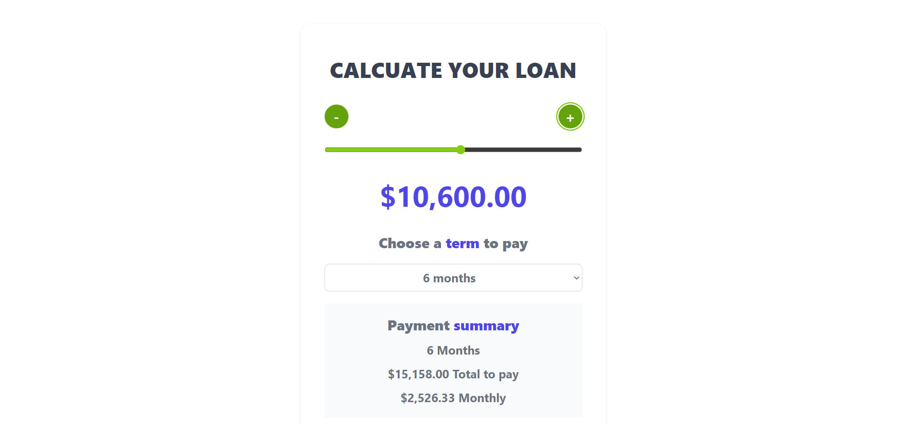

# Loan Calculator
A loan calculator allows us to select an amount of money, a term to pay, and a summary of payments: the total to pay and the monthly fee.

## Built With

- React
- HTML/CSS & JavaScript best practices: Correct use of tags, elements, properties and syntax.
- Linters Check: Local and Pull Request check for errors, bugs and stylistic errors in code.
- Gitflow

## Live Demo

[Live Demo](https://)

### Screenshot

## Getting Started

To get a local copy up and running follow these simple example steps.

### Prerequisites
- Have a source code editor such as VSCode
- Install nodeJS along with NPM

### Setup
- Clone this repository into your local environment with `git clone https://github.com/vvoo21/loan-calculator.git`

### Install
- Just run `npm i` on the root of the project and you're good to go. All of the necesary packages will be installed for you!

### Run tests
- Run `npm start` to se a live version of the project on your browser
- Run `npx hint .` to get Webhint going, a linter for HTML
- Run `npx stylelint --fix "**/*.{css,scss}"` to get Stylelint going, a linter for CSS
- Run `npx eslint --fix .` to get ESLint going, a linter for JS

### Deployment
- Run `npm run build` for Webpack to generate the dist files corresponding to your actual /src files

## Author

👤 **Vanessa Oliveros Padron**

- GitHub: [@vvoo21](https://github.com/vvoo21)
- Twitter: [@vaneoliverosp](https://twitter.com/vaneoliverosp)
- LinkedIn: [vaneoliverosp](https://www.linkedin.com/in/vaneoliverosp/)

## 🤝 Contributing

Contributions, issues, and feature requests are welcome!

Feel free to check the [issues page](../../issues/).

## Show your support

Give a ⭐️ if you like this project!

## Acknowledgments

- Hat tip to the Microverse program!
- Hat tip to anyone whose code was used!

## 📝 License

This project is [MIT](./LICENSE) licensed.

_NOTE: we recommend using the [MIT license](https://choosealicense.com/licenses/mit/) - you can set it up quickly by [using templates available on GitHub](https://docs.github.com/en/communities/setting-up-your-project-for-healthy-contributions/adding-a-license-to-a-repository). You can also use [any other license](https://choosealicense.com/licenses/) if you wish._
